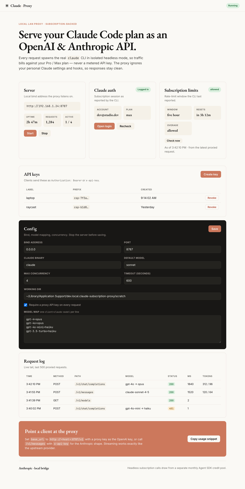
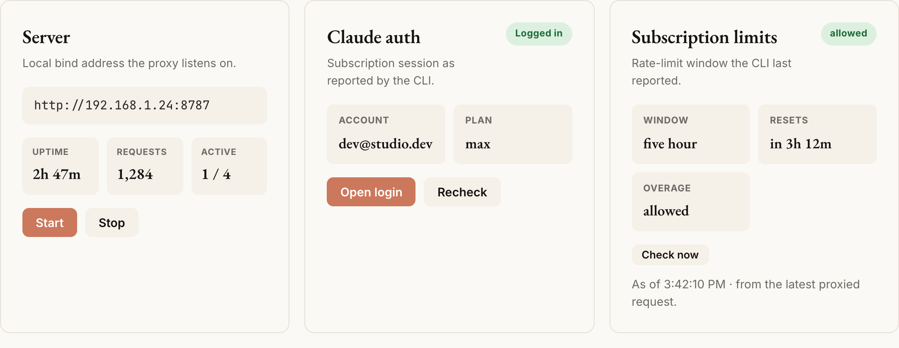
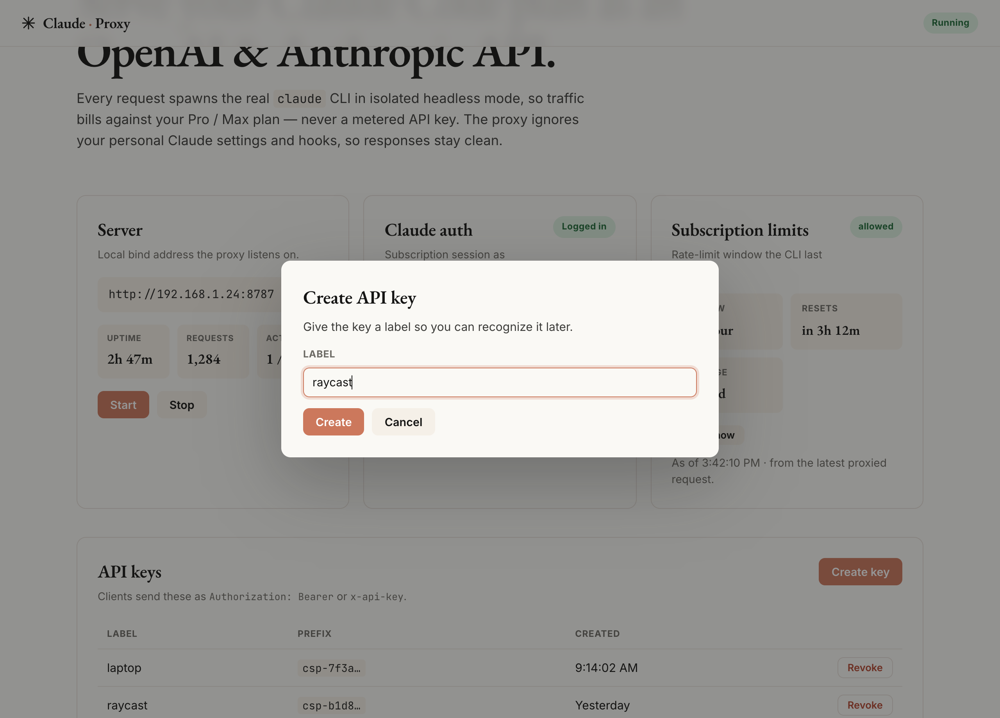

<h1 align="center">Claude Subscription Proxy</h1>

<p align="center">
  <strong>Serve your Claude Code Pro / Max plan as an OpenAI- and Anthropic-compatible local API.</strong>
</p>

<p align="center">
  
  
  
  
</p>

<p align="center">
  
</p>

A small desktop app that runs a local HTTP server exposing your **Claude Code subscription**
as both an **OpenAI-compatible** (`/v1/chat/completions`) and **Anthropic-compatible**
(`/v1/messages`) API. Point any tool that speaks those APIs at the proxy, hand it a
proxy-issued key, and its traffic is billed against your **Pro / Max plan** instead of a
metered API key.

The proxy never forwards OAuth tokens or API keys. It runs every request through the real
[`claude`](https://docs.claude.com/en/docs/claude-code) CLI in **isolated headless mode**
(`claude -p --output-format stream-json`), so Claude Code itself makes the upstream call
under your authenticated session.

> [!IMPORTANT]
> Using a subscription for programmatic/headless access is your responsibility under
> Anthropic's terms. See [Subscription, credits & policy](#subscription-credits--policy).

---

## Features

- **Two API surfaces from one proxy** — OpenAI `/v1/chat/completions`, Anthropic
  `/v1/messages`, plus `GET /v1/models`. Both support **streaming (SSE)** and
  non-streaming.
- **Subscription-backed** — wraps the real `claude` CLI; no token forwarding, no metered
  API key.
- **LAN-ready, key-gated** — binds `0.0.0.0` and requires a proxy API key on every request.
  Keys are generated in the GUI, stored only as SHA-256 hashes, and shown once.
- **Clean responses** — runs the CLI with `--setting-sources ""` and `--strict-mcp-config`,
  so your personal hooks, output styles, and MCP servers never leak into proxied output.
- **Live server status** — uptime, total requests served, and in-flight concurrency.
- **Subscription limits** — surfaces the rate-limit window the CLI reports (type, reset
  countdown, overage), with an on-demand **Check now**.
- **Model mapping** — map client model names (`gpt-4o`, `gpt-4o-mini`, …) to Claude models
  (`opus`, `sonnet`, `haiku`); `claude*` names pass through.
- **Request log** — live tail of the last 500 requests with status, latency, and token
  counts.

<p align="center">
  
</p>

## How it works

```
client (OpenAI/Anthropic SDK)
      │  HTTP + proxy API key
      ▼
┌─────────────────────────────┐
│  Tauri app (Rust + axum)     │
│  • auth gate (Bearer/x-api)  │
│  • flatten messages → prompt │
│  • spawn `claude -p …`       │──►  claude CLI ──►  Anthropic (your subscription)
│  • parse stream-json (NDJSON)│
│  • translate → OpenAI / pass │
│    through Anthropic events  │
└─────────────────────────────┘
```

Each request spawns one `claude` process in a per-request scratch directory with
`--tools "" --max-turns 1 --no-session-persistence` (no project tools, no agentic
behavior), bounded by a request timeout and a process-wide concurrency semaphore. System
text is routed through `--append-system-prompt` (preserving the "You are Claude Code"
identity); prior turns are streamed to the child's stdin. Anthropic mode re-emits the
CLI's own stream events verbatim; OpenAI mode translates them.

## Prerequisites

- **[Claude Code](https://docs.claude.com/en/docs/claude-code) installed** and on `PATH`
  (`claude --version`).
- A **Pro / Max subscription**, logged in:
  ```bash
  claude auth status   # must exit 0; the app surfaces this too
  claude auth login    # if not logged in
  ```
- **Node 20+** and **Rust (stable)** with the
  [Tauri 2 prerequisites](https://tauri.app/start/prerequisites/) for your OS
  (Xcode CLT on macOS, `webkit2gtk` on Linux, MSVC + WebView2 on Windows).

## Quick start

```bash
npm install
npm run tauri dev      # launch the app (debug)
npm run tauri build    # build a release bundle
```

> [!NOTE]
> Use **`npm run tauri build`** (or `npx tauri build`) — there is no global `tauri`
> binary, so a bare `tauri build` will fail with `command not found`.

First launch creates `config.json` and `keys.json` in your platform's app-config dir and
an empty `scratch/` working dir under app-data.

## Connecting a client

Start the server in the app, then create a key and copy it (shown once).

<p align="center">
  
</p>

### OpenAI-compatible

```bash
curl http://192.168.1.24:8787/v1/chat/completions \
  -H "Authorization: Bearer csp-<your-key>" \
  -H "Content-Type: application/json" \
  -d '{"model":"gpt-4o","messages":[{"role":"user","content":"Reply with exactly: OK"}]}'
```

- `base_url`: `http://<host>:8787/v1`
- Auth: send the proxy key as the OpenAI key (`Authorization: Bearer …` or `x-api-key`).
- Add `"stream": true` for SSE (`chat.completion.chunk` … `data: [DONE]`).
- Sampling params (`temperature`, `top_p`, `max_tokens`, …) are accepted and ignored — the
  CLI exposes no equivalent knobs.

### Anthropic-compatible

```bash
curl http://192.168.1.24:8787/v1/messages \
  -H "x-api-key: csp-<your-key>" \
  -H "anthropic-version: 2023-06-01" \
  -H "Content-Type: application/json" \
  -d '{"model":"claude-sonnet-4-5","max_tokens":64,"messages":[{"role":"user","content":"Reply with exactly: OK"}]}'
```

- `base_url`: `http://<host>:8787` (the SDK appends `/v1/messages`).
- With `"stream": true`, the proxy re-emits the native Anthropic event stream
  (`message_start` → `content_block_delta` → … → `message_stop`).

### Endpoints

| Method | Path | Notes |
|---|---|---|
| `GET`  | `/v1/models` | Claude models ∪ your model-map keys. |
| `POST` | `/v1/chat/completions` | OpenAI shape · non-streaming + SSE. |
| `POST` | `/v1/messages` | Anthropic shape · non-streaming + SSE passthrough. |

## Configuration

Edit in the **Config** panel (stop the server first). Stored at
`<app-config-dir>/config.json`.

| Field | Default | Description |
|---|---|---|
| `bind_address` | `0.0.0.0` | Interface to bind (use `127.0.0.1` for local-only). |
| `port` | `8787` | Listen port. |
| `claude_binary_path` | `claude` | CLI path (PATH lookup unless absolute). |
| `default_model` | `sonnet` | Fallback when a model isn't mapped or `claude*`. |
| `model_map` | `gpt-4o→opus`, `gpt-4o-mini→haiku`, `gpt-4→opus`, `gpt-3.5-turbo→haiku` | Client → Claude model mapping. |
| `max_concurrency` | `4` | Concurrent `claude` processes (extra requests wait). |
| `request_timeout_secs` | `600` | Per-request wall-clock budget. |
| `require_auth` | `true` | Require a proxy API key on every request. |
| `working_dir` | `<app-data>/scratch` | Empty per-request CWD for the CLI. |

## Security

- **Proxy keys** are random `csp-…` tokens; only their SHA-256 hash and an 8-char prefix
  are persisted. The raw key is shown once at creation — copy it then.
- The proxy binds `0.0.0.0` by default so other machines on your LAN can reach it. Keep
  `require_auth` on, or set `bind_address` to `127.0.0.1` for local-only use.
- The proxy does not read, store, or forward your Claude OAuth tokens.
- Image / non-text request content is rejected with HTTP 400 (text completions only).

## Subscription, credits & policy

Anthropic disallows raw-token third-party harnesses (which is why this wraps the official
CLI rather than forwarding tokens). Headless `claude -p` calls on a subscription draw from
a **separate monthly "Agent SDK credit" pool** rather than your interactive limits. Every
request through this proxy — including the **Check now** limits probe — consumes that pool.
You are responsible for staying within Anthropic's subscription terms.

## Development

```bash
# Rust backend tests (config, keys, auth gate, CLI runner, translation,
# OpenAI/Anthropic shaping, server lifecycle, metrics/limits, e2e vs real CLI)
cd src-tauri && cargo test

# Frontend helpers (vitest)
npm test

# Type-check + production bundle
npm run build
```

### Project layout

```
src-tauri/src/
  server/claude.rs      subprocess spawn + NDJSON stream-json parsing (core)
  server/translate.rs   messages[] → (system, final user, history) flattening
  server/openai.rs      /v1/models + /v1/chat/completions
  server/anthropic.rs   /v1/messages (verbatim event passthrough)
  server/auth.rs        bearer / x-api-key middleware
  server/state.rs       runtime, metrics, rate-limit snapshot, ring-buffer log
  server/mod.rs         router + server lifecycle (axum serve, graceful shutdown)
  config.rs keys.rs     persisted config + SHA-256 key store
  claude_auth.rs        `claude auth status` + macOS login helper
  commands.rs           Tauri commands the dashboard invokes
src/                    vanilla-TS dashboard (Server, Auth, Keys, Config, Limits, Logs)
```

## Limitations

- **Multi-turn** is reconstructed by flattening prior turns into the prompt (the CLI takes
  one prompt, not a typed message array).
- **Sampling params are ignored** — no CLI equivalent.
- **Login button is macOS-first** (`osascript` opens Terminal for the OAuth flow); on other
  platforms run `claude auth login` manually.
- Subscription limits populate after the first proxied request (or via **Check now**) —
  the CLI only reports them alongside a turn.

## License

No license is set yet — add a `LICENSE` (e.g. MIT) before publishing publicly. Use of the
proxy is governed by Anthropic's subscription terms.
